# PORMAKE
**Por**ous materials **Make**r

> Python library for the construction of porous materials using topology and building blocks.
>
> [Please cite me if you find it useful!](https://pubs.acs.org/doi/abs/10.1021/acsami.1c02471)

Development Roadmap (updated 2024.12.20):
1. Change of project management tool: `poetry` to `uv`
1. Simple web application for the generation of porous materials
1. Enrich the code with descriptive docstrings.
1. Fortify the project by implementing comprehensive test code.
1. Development of an enhanced algorithm for improved placement of edge building blocks (considering symmetry).

## Release Note
#### New fork
[Repository URL](https://github.com/geonho42/PORMAKE/tree/dev/pormake)

This fork attempted to solve an issue in PORMAKE where, when generating Porous materials, linkers would be inserted with random rotation around the axis formed by two connection points. For those who need this functionality, please refer to the [README](https://github.com/geonho42/PORMAKE/tree/dev/example/script/pormake_v2) of this fork.

Thank you for your valuable contribution @geonho42 !

#### Version: `0.2.1`

**New feature added**: Building blocks with partial charge

The example can be found in [here](./example/notebook/test_charged.py). 

Thank you for your valuable contribution @aniruddha-seal !

#### Version: `0.2.0`

**New feature added**: A module for extracting building blocks from MOFs

[MOF Decomposer README](./pormake/experimental/decomposer/README.md)

<image src="doc/decomposer.png" width="500px"></image>

## Installation

### 1. Using PIP

 This method is only valid for Linux and macOS as `jax` supports those operating
systems. It is recommended to use WSL for Windows users.

```
pip install pormake
```

### 2. From source

#### 1. Directly install from Github repository
```
pip install git+https://github.com/Sangwon91/PORMAKE.git
```

#### 2. Editable installtion
```
git clone https://github.com/Sangwon91/PORMAKE.git
pip install -e PORMAKE
```

## Examples

### 1. Construction of HKUST-1

Import `pormake` .

```python
import pormake as pm
```

Load `tbo` topology from the default database.

```python
database = pm.Database()
tbo = database.get_topo("tbo")
```

You can check the information using `.describe()` method.

```python
tbo.describe()
```

In this case, there are two node types (`0` and `1`) and one edge type (`(0, 1)`). `CN` in the node information indicates coordination number (number of adjacent nodes).

```
===============================================================================
Topology tbo
Spacegroup: Fm-3m
-------------------------------------------------------------------------------
# of slots: 152 (56 nodes, 96 edges)
# of node types: 2
# of edge types: 1

-------------------------------------------------------------------------------
Node type information
-------------------------------------------------------------------------------
Node type: 0, CN: 3
  slot indices: 0, 1, 2, 3, 4, 5, 6, 7, 8, 9
                10, 11, 12, 13, 14, 15, 16, 17, 18, 19
                20, 21, 22, 23, 24, 25, 26, 27, 28, 29
                30, 31
Node type: 1, CN: 4
  slot indices: 32, 33, 34, 35, 36, 37, 38, 39, 40, 41
                42, 43, 44, 45, 46, 47, 48, 49, 50, 51
                52, 53, 54, 55

-------------------------------------------------------------------------------
Edge type information (adjacent node types)
-------------------------------------------------------------------------------
Edge type: (0, 1)
  slot indices: 56, 57, 58, 59, 60, 61, 62, 63, 64, 65
                66, 67, 68, 69, 70, 71, 72, 73, 74, 75
                76, 77, 78, 79, 80, 81, 82, 83, 84, 85
                86, 87, 88, 89, 90, 91, 92, 93, 94, 95
                96, 97, 98, 99, 100, 101, 102, 103, 104, 105
                106, 107, 108, 109, 110, 111, 112, 113, 114, 115
                116, 117, 118, 119, 120, 121, 122, 123, 124, 125
                126, 127, 128, 129, 130, 131, 132, 133, 134, 135
                136, 137, 138, 139, 140, 141, 142, 143, 144, 145
                146, 147, 148, 149, 150, 151
===============================================================================
```

You can also visualize the topology using `.view()` method.

```python
tbo.view()
```

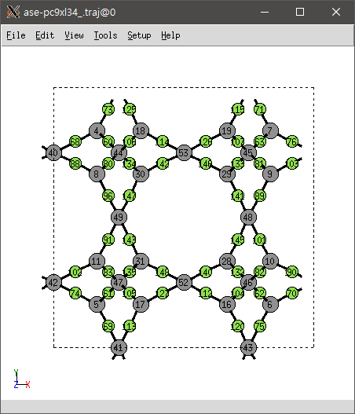

In order to construct HKUST-1, copper paddle-wheel cluster and BTC linker are required.  You can load the building blocks from the database. All visual description of the building blocks can be found at [here](doc/building_blocks.pdf).

```python
# bb: budilding block.
# Copper paddle-wheel.
N409 = database.get_bb("N409")
# BTC linker.
N10 = database.get_bb("N10")
```

You can visualize building blocks using `.view()` method.

```python
N409.view()
N10.view()
```

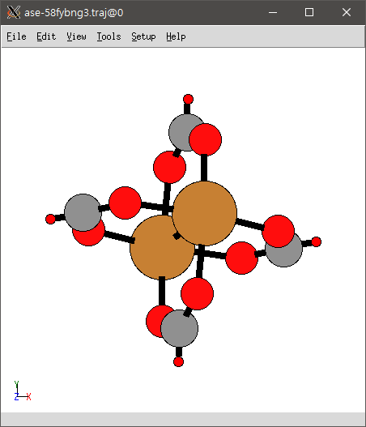 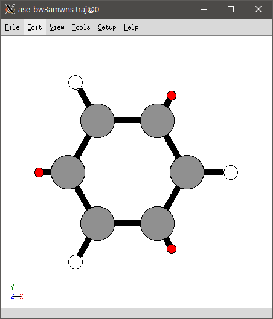

Next, make `Builder` instance.

```python
builder = pm.Builder()
```

Make node type to building block dictionary. This dictionary is used for the construction of the MOF. Building blocks have to be assigned to each node type (in this case, `0` and `1`).

```python
# N10 is assigned to node type 0 because the coordination number of node type 0 is 3.
# Likewise, N409 is assigned to node type 1.
node_bbs = {
    0: N10,
    1: N409
}
```

Construct HKUST-1 using `builder`.

```python
HKUST1 = builder.build_by_type(topology=tbo, node_bbs=node_bbs)
```

You can visualize constructed MOF using `.view()` method.

```python
HKUST1.view()
```

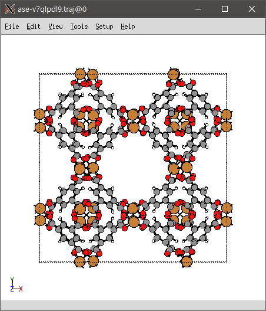

And save the HKUST-1 in `cif` format.

```python
HKUST1.write_cif("HKUST-1.cif")
```


### 2. Inserting edge building block to HKUST-1

From the above example, we can insert edge building blocks between `N409` and `N10`.

Load long and thin edge building block from the database.

```python
E41 = database.get_bb("E41")
E41.view()
```

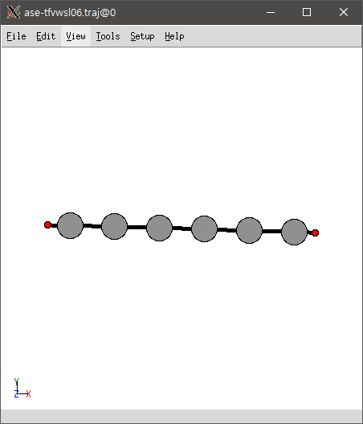

Make edge type to building block dictionary. Edge type is a tuple of the types of adjacent nodes: (`0`, `1`).

```python
edge_bbs = {(0, 1): E41}
```

Make new MOF with  `edge_bbs`.

```python
MOF = builder.build_by_type(topology=tbo, node_bbs=node_bbs, edge_bbs=edge_bbs)
```

Check the constructed MOF.

```python
MOF.view()
```

`E41` is inserted properly between `N409` and `N10`.


### 3. Construction of *Chimera* MOF

`pormake` can assign different building block to each slot. In this example, we will replace some of `N409` to porphyrin.

Load porphyrin from the database.

```python
N13 = database.get_bb("N13")
N13.view()
```


Before the next step, you should know the equivalence of the following two approaches for MOF construction.

```python
# Approach 1.
MOF = builder.build_by_type(topology=tbo, node_bbs=node_bbs, edge_bbs=edge_bbs)

# Approach 2.
# Same operation with different code.
bbs = builder.make_bbs_by_type(topology=tbo, node_bbs=node_bbs, edge_bbs=edge_bbs)
MOF = builder.build(topology=tbo, bbs=bbs)
```

Here, `bbs` is the list of building blocks. `bbs[i]` is the building block at i'th slot.

Change some of `N409` to `N13`. You can get the indices from the `tbo.describe()`

```python
bbs = builder.make_bbs_by_type(topology=tbo, node_bbs=node_bbs, edge_bbs=edge_bbs)

bbs[33] = N13.copy()
bbs[38] = N13.copy()
bbs[40] = N13.copy()
bbs[49] = N13.copy()
bbs[53] = N13.copy()
bbs[55] = N13.copy()
```

Make chimera MOF with modified `bbs`.

```python
MOF = builder.build(topology=tbo, bbs=bbs)
MOF.view()
```

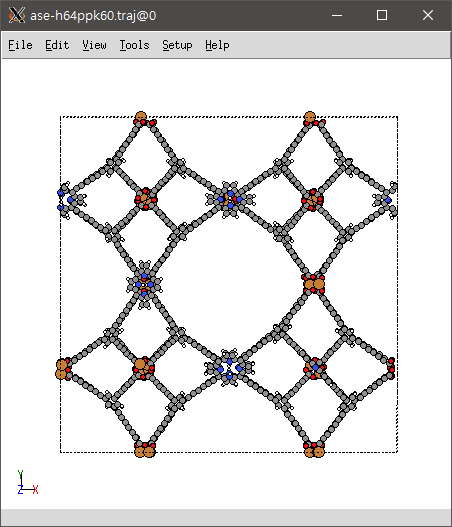

### 4. Calculation of RMSD between node and building block

The root-mean-square deviation of atomic positions (RMSD) between node and building block can be used as a criterion for determining whether a particular building block can be located to a particular node.

Load metal cluster of triangular prism shape.

```python
N198 = database.get_bb("N198")
N198.view()
```

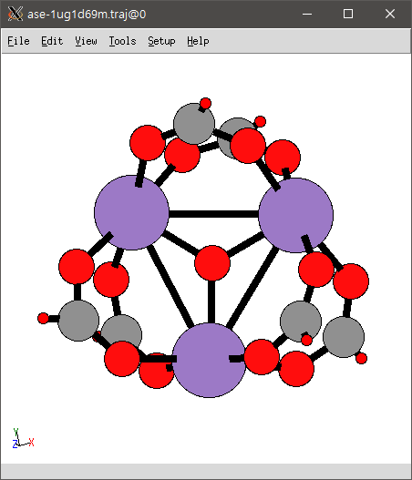

Load two test topologies: `pcu` and `acs`. `pcu` has nodes of octahedron shape and `acs` has nodes of triangular prism shape. Each topology has single node type (`0`).

```python
pcu = database.get_topo("pcu")
pcu.describe()
```

```
===============================================================================
Topology pcu
Spacegroup: Pm-3m
-------------------------------------------------------------------------------
# of slots: 4 (1 nodes, 3 edges)
# of node types: 1
# of edge types: 1

-------------------------------------------------------------------------------
Node type information
-------------------------------------------------------------------------------
Node type: 0, CN: 6
  slot indices: 0

-------------------------------------------------------------------------------
Edge type information (adjacent node types)
-------------------------------------------------------------------------------
Edge type: (0, 0)
  slot indices: 1, 2, 3
===============================================================================
```


```python
acs = database.get_topo("acs")
acs.describe()
```

```
===============================================================================
Topology acs
Spacegroup: P63/mmc
-------------------------------------------------------------------------------
# of slots: 8 (2 nodes, 6 edges)
# of node types: 1
# of edge types: 1

-------------------------------------------------------------------------------
Node type information
-------------------------------------------------------------------------------
Node type: 0, CN: 6
  slot indices: 0, 1

-------------------------------------------------------------------------------
Edge type information (adjacent node types)
-------------------------------------------------------------------------------
Edge type: (0, 0)
  slot indices: 2, 3, 4, 5, 6, 7
===============================================================================
```

You can check the shape of node via `LocalStructure` object.

```python
# 0 is the type of node.
# Octahedron shape.
pcu_local_0 = pcu.unique_local_structures[0]
pcu_local_0.view()
```

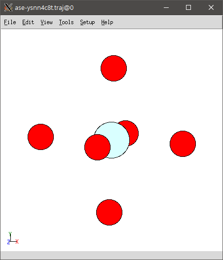 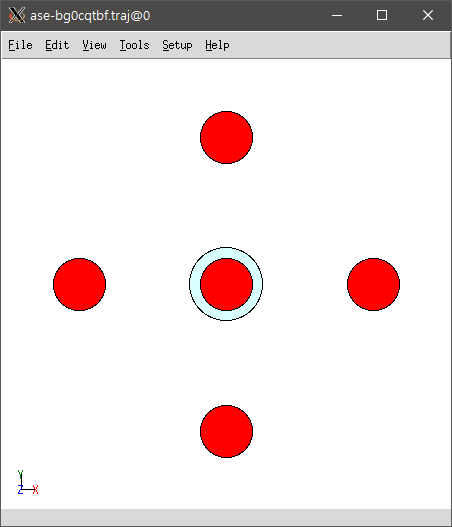

```python
# 0 is the type of node.
# Triangular prism shape.
acs_local_0 = acs.unique_local_structures[0]
acs_local_0.view()
```

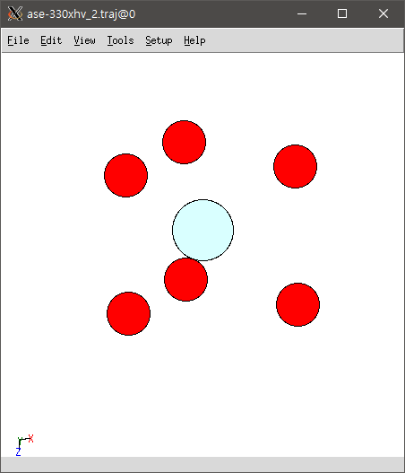 

Make `Locator` instance.

```python
locator = pm.Locator()
```

Calculate RMSD values using the `locator`. As expected, you can see that the RMSD value of the `pcu` (0.42) is bigger than that of `acs` (0.02).

```python
acs_rmsd_0 = locator.calculate_rmsd(acs_local_0, N198)
print("RMSD at acs node type 0: %.2f" % acs_rmsd_0)
```

```
RMSD at acs node type 0: 0.02
```


```python
pcu_rmsd_0 = locator.calculate_rmsd(pcu_local_0, N198)
print("RMSD at pcu node type 0: %.2f" % pcu_rmsd_0)
```

```
RMSD at pcu node type 0: 0.42
```

In general, `RMSD < 0.3`  is good threshold for the MOF constructions.


### 5. Simple example of MOF construction using low-symmetry building blocks

Load `ith` topology.

```python
ith = database.get_topo("ith")
ith.describe()
```

```
===============================================================================
Topology ith
Spacegroup: Pm-3n
-------------------------------------------------------------------------------
# of slots: 32 (8 nodes, 24 edges)
# of node types: 2
# of edge types: 1

-------------------------------------------------------------------------------
Node type information
-------------------------------------------------------------------------------
Node type: 0, CN: 4
  slot indices: 0, 1, 2, 3, 4, 5
Node type: 1, CN: 12
  slot indices: 6, 7

-------------------------------------------------------------------------------
Edge type information (adjacent node types)
-------------------------------------------------------------------------------
Edge type: (0, 1)
  slot indices: 8, 9, 10, 11, 12, 13, 14, 15, 16, 17
                18, 19, 20, 21, 22, 23, 24, 25, 26, 27
                28, 29, 30, 31
===============================================================================
```

Load and visualize node building blocks. `N114` is the building block of low-symmetry.

```python
node_bbs = {
    0: database.get_bb("N3"),
    1: database.get_bb("N114"),
}

for bb in node_bbs.values():
    bb.view()
```

 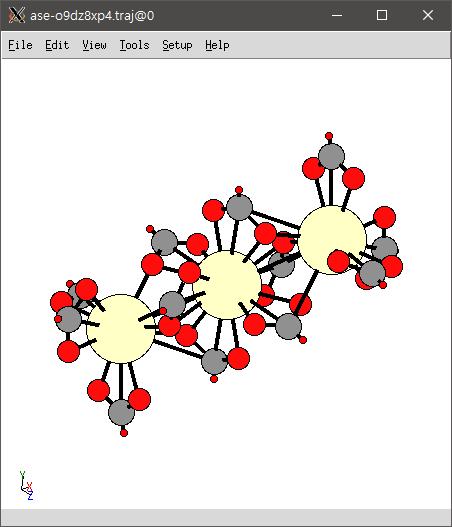

Check RMSD values.

```python
for key, bb in node_bbs.items():
    local = ith.unique_local_structures[key]
    rmsd = locator.calculate_rmsd(local, bb)
    print("RMSD: %.2f" % rmsd)
```

```
RMSD: 0.16
RMSD: 0.27
```

Load edge building block.

```python
edge_bbs = {(0, 1): database.get_bb("E41")}
edge_bbs[(0, 1)].view()
```


Make MOF.

```python
MOF = builder.build_by_type(topology=ith, node_bbs=node_bbs, edge_bbs=edge_bbs)
MOF.view()
```

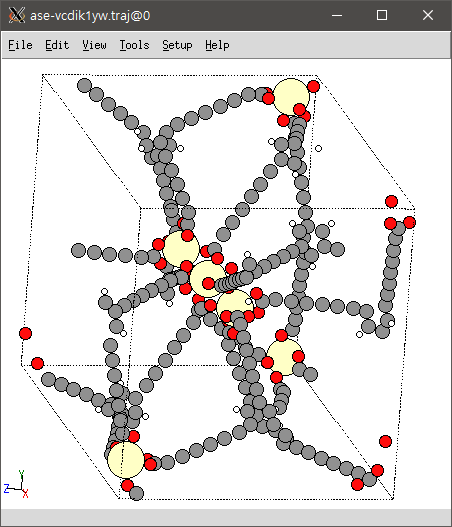 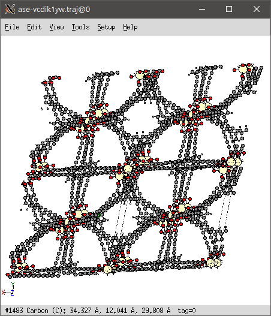

### 6. Custom building block

PORMAKE can read building blocks from xyz file. In xyz file, all connection points are denoted as symbol `X`.

Users can assign bond manually as shown below:

`N10.xyz`:
```
12
    9   10   11
C    0.0000 0.0000 0.0000
C    0.7700 -1.3336 0.0000
C    2.3100 -1.3336 0.0000
C    3.0800 0.0000 0.0000
C    2.3100 1.3336 0.0000
C    0.7700 1.3336 0.0000
H    0.2000 -2.3210 0.0000
H    4.2200 0.0000 0.0000
H    0.2000 2.3210 0.0000
X    -0.7500 0.0000 0.0000
X    2.6850 -1.9831 0.0000
X    2.6850 1.9831 0.0000
   0    1 A
   0    5 A
   1    2 A
   1    6 S
   2    3 A
   3    4 A
   3    7 S
   4    5 A
   5    8 S
   9    0 S
  10    2 S
  11    4 S
```

The first two columns are the indices of atoms consisting the bond and the third term is bond type.
Supported bond types include single (`A`), double (`D`), triple (`T`), and aromatic (`A`).
If no bond information is fed, bonds are automatically generated by distance threshold but all bond types are assignged to single bond.

You can load building block using `BuilingBlock` object like below:

```python
bb = pm.BuildingBlock('N10.xyz')
```
