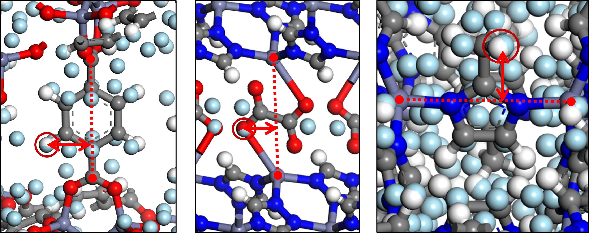
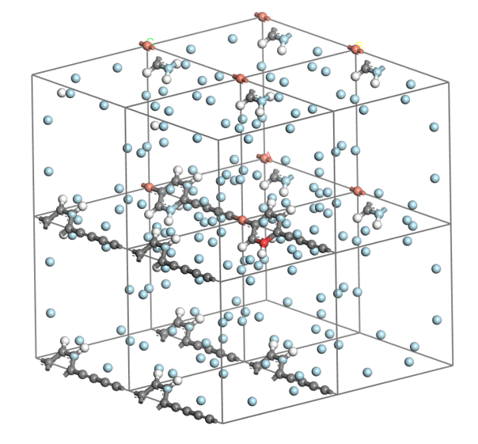
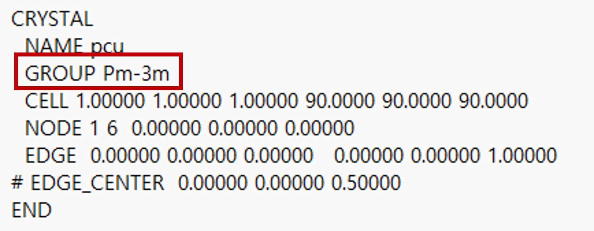

# POREMAKE v2

This code addresses the problems encountered when generating small pore size porous materials using **PORMAKE**. These problems are solved by rotating the linkers to match the space group of the topology.

In **PORMAKE**, linkers are placed arbitrarily, leading to collisions or failure to accurately model the real structure for small pore sizes. To mitigate this, **PORMAKE v2** rotates and arranges the linkers according to the space group of each topology.

In addition, single metal node building blocks are added as an alternative to cluster building blocks, and corresponding organic linkers and organic node building blocks are added to generate porous materials with **small pore sizes**.

---
- [POREMAKE v2](#poremake-v2)
  - [Part 0: How to Use](#part-0-how-to-use)
  - [Part 1: PORMAKE Setup](#part-1-pormake-setup)
    - [1-1: Basic Setup](#1-1-basic-setup)
    - [1-2: Additional Settings for PORMAKE v2](#1-2-additional-settings-for-pormake-v2)
    - [1-3: Generation of Structures with PORMKAE](#1-3-generation-of-structures-with-pormkae)
  - [Part 2: Rotate Linkers to Align with Space Group](#part-2-rotate-linkers-to-align-with-space-group)
    - [2-1: Initial Setup for Rotation](#2-1-initial-setup-for-rotation)
    - [2-2: Applying Rotations](#2-2-applying-rotations)
    - [2-3: Adding Extra Reference Points](#2-3-adding-extra-reference-points)
    - [2-4. Log File Example](#2-4-log-file-example)
  - [Part 3: Structure Optimization using MLIP](#part-3-structure-optimization-using-mlip)
---

## Part 0: How to Use

### Installation

#### Editable installtion
```
git clone https://github.com/geonho42/PORMAKE_v2.git
pip install -e PORMAKE_v2
pip install m3gnet
```

### Run the script
Run the script located at:

```bash
/PORMAKE_v2/example/script/pormake_v2/pormake_v2.py
```
If you run the script after the **basic setup(1-1)**, you can get `{name}_PORMAKE_v2.cif` with linker rotation and `{name}_PORMAKE_v2_relax.cif` with optimization.

### How to use Single Metal Node and Corresponding Building Blocks

You can use new building blocks for small pore size porous materials at:
```bash
/PORMAKE_v2/example/script/pormake_v2/pormake_v2_database/bbs/
```
E: Organic Linkers, M: Single Metal Nodes, N: Organic Nodes

```python
from pathlib import Path
import pormake as pm

name = "ZIF-2"
database = pm.Database()
new_database = pm.Database(bb_dir=Path("./pormake_v2_database/bbs"))
topo = database.get_topo("sod")
node_bb = new_database.get_bb("M2")    #Zn single metal node with cn 4
edge_bb = new_database.get_bb("E27")

builder = pm.Builder()
current_node = {}
current_edge = {}

current_node[0] = node_bb
current_edge[(0, 0)] = edge_bb
```

---

## Part 1: PORMAKE Setup

### 1-1: Basic Setup

```python
import pormake as pm

name = {materials_name}
database = pm.Database()

topo = database.get_topo("{topology}")
node_bb = database.get_bb("{node}")
edge_bb = database.get_bb("{edge}")

builder = pm.Builder()
current_node = {}
current_edge = {}

current_node[0] = node_bb
current_edge[(0, 0)] = edge_bb
```

This configuration is identical to the original **PORMAKE** setup. Please refer to the **PORMAKE README file** for more details.

**Note**: Mixing multiple edge types is not currently supported in **PORMAKE v2**.

---

### 1-2: Additional Settings for PORMAKE v2

```python
for i, edge in enumerate(topo.edge_types):
    if tuple(edge.tolist()) in current_edge:
        if current_edge[tuple(edge.tolist())] is not None:
            first_valid_edge_index = i - topo.n_nodes
            edge_representer = current_edge[tuple(edge.tolist())].find_furthest_atom_index()
            break

none_edge_list = []
for i, edge in enumerate(topo.edge_types):
    if i >= topo.n_nodes:
        if current_edge[tuple(edge.tolist())] is None:
            none_edge_list.append(1)
        else:
            none_edge_list.append(0)
```

- **Valid linkers**: Linkers other than `None` are selected.
- **Representative Atom**: To apply space group rotations, a representative atom is selected as the atom furthest from the center axis of the linker.



---

### 1-3: Generation of Structures with PORMKAE
```python
GUN = builder.build_by_type(
    topo,
    current_node,
    current_edge,
    first_valid_edge_index=first_valid_edge_index,
    edge_representer=edge_representer,
)
GUN.write_cif(name + '_PORMAKE.cif', spacegroup_vis=False)
```

The structure generated by PORMAKE is output in CIF format.
If `spacegroup_vis=True`, the space group applied to the representative atom of the linker is displayed on the structure.



The reference atoms are colored red and the atoms in the space group are colored light blue.

**Note**: The space group is determined from the `{topology}.cgd` file.



---

## Part 2: Rotate Linkers to Align with Space Group
### 2-1: Initial Setup for Rotation
```python
edge_angle_interval = 10
first_edge_angle_interval = 30
threshold = 0.3
energy_per_atom_list = []
min_angle_list_list = []
relaxer = Relaxer()
m3gnet_model = M3GNet()
potential = Potential(model=m3gnet_model)
calculator = M3GNetCalculator(potential=potential)
```
- **`edge_angle_interval`**: Defines the rotation interval for the linker. Smaller intervals increase accuracy but take more time.

- **`first_edge_angle_interval`**: Sets the rotation interval for the first reference linker.

- **Energy Calculation**: The `M3GNet()` module is used to evaluate the energy of each configuration.

---

### 2-2: Applying Rotations

```python
with open('./log.out', 'a') as f:
    for i in range(0, 91, first_edge_angle_interval):
        rotating_angle_list = [0] * topo.n_edges
        rotating_angle_list[first_valid_edge_index] = i
        min_angle_list = [0] * topo.n_edges
        min_angle_list[first_valid_edge_index] = i
        min_error = [100] * topo.n_edges
        min_error[first_valid_edge_index] = 0
        for e in range(0, topo.n_edges):
            if none_edge_list[e] == 1:
                min_error[e] = 0
        for j in range(0, 360, edge_angle_interval):
            rotating_angle_list = [j] * topo.n_edges
            rotating_angle_list[first_valid_edge_index] = i
            GUN = builder.build_by_type(
                topo,
                current_node,
                current_edge,
                first_valid_edge_index=first_valid_edge_index,
                rotating_angle_list=rotating_angle_list,
                edge_representer=edge_representer,
            )
            for k in [
                x for x in range(0, topo.n_edges) if x != first_valid_edge_index
            ]:
                if GUN.min_array[k] < min_error[k]:  # update
                    min_error[k] = GUN.min_array[k]
                    min_angle_list[k] = j
            print(
                f'first edge angle: {i}, remain edge angle: {j}',
                file=f,
                flush=True,
            )
            print(
                f'angle: {min_angle_list}\nerror: {min_error}',
                file=f,
                flush=True,
            )
            if all(value < threshold for value in min_error):
                break
        GUN = builder.build_by_type(
            topo,
            current_node,
            current_edge,
            first_valid_edge_index=first_valid_edge_index,
            rotating_angle_list=min_angle_list,
            edge_representer=edge_representer,
        )
```

Measure the error with the reference element of the space group and store the angle when it is the smallest, rotate 360 degrees, and update the angle.

```python
        ase_atoms = GUN.atoms
        lattice = ase_atoms.cell.array
        filtered_positions = []
        filtered_species = []
        for atom in ase_atoms:
            if atom.symbol != 'Ne':
                filtered_positions.append(atom.position)
                filtered_species.append(Element(atom.symbol))
        pmg_structure = Structure(lattice, filtered_species, filtered_positions)
        calculator.calculate(pmg_structure)
        energy_per_atom = float(
            calculator.results["energy"] / len(pmg_structure)
        )
        energy_per_atom_list.append(energy_per_atom)
        min_angle_list_list.append(min_angle_list)

        print(
            f'*First angle {i} is done. Energy per atom is {energy_per_atom}',
            file=f,
            flush=True,
        )
```

Measure the energy for each first edge angle.

```python
    min_angle_list = min_angle_list_list[np.argmin(energy_per_atom_list)]
```

Save the structure with the lowest energy.

```python
    GUN = builder.build_by_type(
        topo,
        current_node,
        current_edge,
        first_valid_edge_index=first_valid_edge_index,
        rotating_angle_list=min_angle_list,
        edge_representer=edge_representer,
    )
    print(
        f'Final angle: {min_angle_list}\nFinal error: {GUN.min_array}',
        file=f,
        flush=True,
    )
```

Save the results.

---

### 2-3: Adding Extra Reference Points

```python
extra = []
with open('./log.out', 'a') as f:
    while max(GUN.min_array) > 1.0:
        print("add extra edge", file=f, flush=True)
        extra.append(np.argmax(GUN.min_array))
        rotating_angle_list = [0] * topo.n_edges
        rotating_angle_list[first_valid_edge_index] = min_angle_list[
            first_valid_edge_index
        ]
        for ex in extra:
            rotating_angle_list[ex] = min_angle_list[ex]
        min_angle_list = copy.deepcopy(rotating_angle_list)
        min_error = [100] * topo.n_edges
        min_error[first_valid_edge_index] = 0
        for ex in extra:
            min_error[ex] = 0
        for e in range(0, topo.n_edges):
            if none_edge_list[e] == 1:
                min_error[e] = 0
        for j in range(0, 180, edge_angle_interval):
            for i in range(0, topo.n_edges):
                if i not in extra and i != first_valid_edge_index:
                    rotating_angle_list[i] = j
            GUN = builder.build_by_type(
                topo,
                current_node,
                current_edge,
                first_valid_edge_index=first_valid_edge_index,
                rotating_angle_list=rotating_angle_list,
                edge_representer=edge_representer,
                extra=extra,
            )
            for k in range(0, topo.n_edges):
                if GUN.min_array[k] < min_error[k]:  # update
                    min_error[k] = GUN.min_array[k]
                    min_angle_list[k] = j
            print(
                f'angle: {min_angle_list}\nerror: {min_error}',
                file=f,
                flush=True,
            )
            if all(value < threshold for value in min_error):
                break

        GUN = builder.build_by_type(
            topo,
            current_node,
            current_edge,
            first_valid_edge_index=first_valid_edge_index,
            rotating_angle_list=min_angle_list,
            edge_representer=edge_representer,
            extra=extra,
        )
        print(
            f'Final angle(extra): {min_angle_list}\nFinal error(extra): {GUN.min_array}',
            file=f,
            flush=True,
        )

    print('Done', file=f, flush=True)
```

If the largest error is greater than 1.0 and the threshold criterion is not met, an additional reference point is added to ensure that the space group is satisfied among linkers with large errors.

---

### 2-4. Log File Example

```plaintext
first edge angle: 0, remain edge angle: 0
angle: [0, 0, 0, 0, 0]
error: [0, 1.31, 0.12, 2.81, 4.02]
first edge angle: 0, remain edge angle: 10
angle: [0, 0, 0, 10, 0]
error: [0, 1.31, 0.12, 2.41, 4.02]
......
first edge angle: 0, remain edge angle: 340
angle: [0, 260, 0, 80, 180]
error: [0, 0.08, 0.12, 0.05, 0.13]
first edge angle: 0, remain edge angle: 350
angle: [0, 260, 0, 80, 180]
error: [0, 0.08, 0.12, 0.05, 0.13]
*First angle 0 is done. Energy per atom is -4.5e-06
......
*First angle 90 is done. Energy per atom is -4.8e-06
Final angle: [90, 350, 90, 170, 270]
Final error: [0.0, 0.08, 0.12, 0.04, 0.12]

```

It specifies the angle of the first edge, rotates the rest of the linkers, measures the error and stores the angle with the smallest angle error.

At the end of a cycle, the angle with the smallest error and the energy of the structure are stored.

Repeat the above cycle to finally select the structure with the lowest energy.

---

## Part 3: Structure Optimization using MLIP

```python
pmg_structure = Structure.from_file(name + '_PORMAKE_v2.cif')
relax_results = relaxer.relax(pmg_structure, steps=10000, fmax=0.05)
energy_per_atom = float(
    relax_results['trajectory'].energies[-1] / len(pmg_structure)
)
final_structure = relax_results['final_structure']
final_structure.to(filename=name + '_PORMAKE_v2_relax.cif')
```

- Uses MLIP to optimize the structure in a single step
- Adjust `steps` and `fmax` to control the intensity of the optimization.
